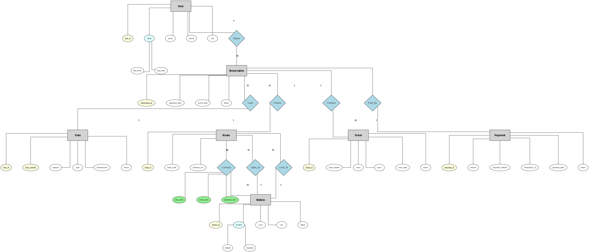
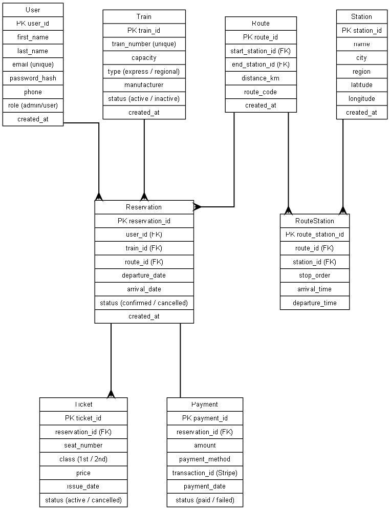
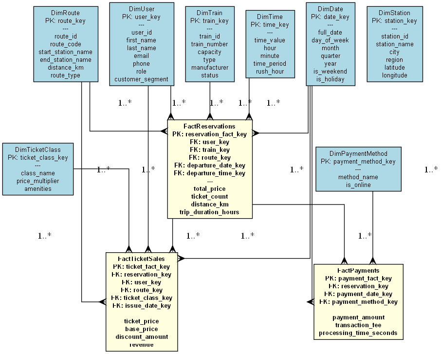

# Trainy - Система за резервация на влакове

## Студентска информация
- **Факултетен номер:** 2301321029
- **Име:** Никола Вълков

---

## Описание на проекта

Trainy е система за управление на влакови резервации, която моделира реална платформа за онлайн резервации подобна на БДЖ. Системата обхваща пълния цикъл на резервациите - от търсене на маршрути до обработка на плащания.

### Основни функционалности:
- Управление на потребители (администратори и клиенти)
- Управление на гари и маршрути с междинни спирки
- Информация за влакове (капацитет, тип, производител)
- Система за резервации с различни класове билети
- Обработка на плащания (кредитна карта, PayPal, Stripe)
- Аналитични дашбордове в Power BI

---

## Диаграми на базата данни

### 1. Концептуален модел (Chen's Notation)


**Характеристики:**
- **7 обекта:** User, Train, Station, Route, Reservation, Ticket, Payment
- **36+ атрибута** (включително композитни атрибути: name, location)
- **8 релации** с кардиналности (1, N, M)
- **Връзка M:N:** Route ↔ Station чрез RouteStation

---

### 2. Логически модел (Crow's Foot Notation)


**Характеристики:**
- **8 нормализирани таблици** (3NF)
- **56+ атрибута**
- Ясно маркирани PK и FK
- Crow's Foot нотация за кардиналности
- Junction таблица **RouteStation** за M:N връзка

---

### 3. Data Warehouse модел (UML Notation)


**Звездна схема (Star Schema):**
- **3 Fact таблици:**
  - FactReservations (данни за резервации)
  - FactPayments (данни за плащания)
  - FactTicketSales (данни за продажби на билети)

- **8 Dimension таблици:**
  - DimUser, DimTrain, DimStation, DimRoute
  - DimDate, DimTime, DimPaymentMethod, DimTicketClass

---

## Схема на базата данни

### Таблици:

#### Users
Информация за потребителски акаунти.
- `user_id` (PK), `first_name`, `last_name`, `email` (UNIQUE)
- `password_hash`, `phone`, `role`, `created_at`

#### Station
Железопътни гари с географска информация.
- `station_id` (PK), `name`, `city`, `region`
- `latitude`, `longitude`, `created_at`

#### Route
Влакови маршрути между гари.
- `route_id` (PK), `start_station_id` (FK), `end_station_id` (FK)
- `distance_km`, `route_code`, `created_at`

#### RouteStation
Junction таблица за връзка M:N между Route и Station.
- `route_station_id` (PK), `route_id` (FK), `station_id` (FK)
- `stop_order`, `arrival_time`, `departure_time`

#### Train
Информация за влакове.
- `train_id` (PK), `train_number` (UNIQUE), `capacity`
- `type`, `manufacturer`, `status`, `created_at`

#### Reservation
Резервации на клиенти.
- `reservation_id` (PK), `user_id` (FK), `train_id` (FK), `route_id` (FK)
- `departure_date`, `arrival_date`, `status`, `created_at`

#### Ticket
Билети свързани с резервации.
- `ticket_id` (PK), `reservation_id` (FK), `seat_number`
- `class`, `price`, `issue_date`, `status`

#### Payment
Плащания за резервации.
- `payment_id` (PK), `reservation_id` (FK), `amount`
- `payment_method`, `transaction_id`, `payment_date`, `status`

---

## Обекти в базата данни

### Stored Procedure: `sp_CreateReservation`
Създава нова резервация с автоматично генериране на билет и изчисляване на цена.

**Параметри:**
- `@user_id`, `@train_id`, `@route_id` - ID-та на обекти
- `@departure_date`, `@arrival_date` - дати на пътуване
- `@seat_number`, `@class` - място и клас
- `@base_price` - базова цена

**Логика:**
1. Изчислява крайна цена чрез функцията `fn_CalculatePrice`
2. Създава резервация със статус 'pending'
3. Автоматично създава билет

**Пример:**
```sql
EXEC dbo.sp_CreateReservation 
    @user_id = 1, @train_id = 1, @route_id = 1,
    @departure_date = '2025-12-01 08:00',
    @arrival_date = '2025-12-01 10:00',
    @seat_number = 'A1', @class = '1st', @base_price = 30.00;
```

---

### Function: `fn_CalculatePrice`
Изчислява цена на билет според класа.

**Параметри:**
- `@class` - клас на билета (1st, 2nd)
- `@basePrice` - базова цена

**Логика:**
- **1ви клас:** базова цена × 1.5
- **2ри клас:** базова цена × 1.0

**Пример:**
```sql
SELECT dbo.fn_CalculatePrice('1st', 30.00); -- Връща: 45.00
SELECT dbo.fn_CalculatePrice('2nd', 30.00); -- Връща: 30.00
```

---

### Trigger: `trg_Payment_Confirm`
Автоматично актуализира статуса на резервация при успешно плащане.

**Тип:** AFTER INSERT на таблица Payment

**Логика:**
- Изпълнява се след вмъкване на нов запис в Payment
- Ако payment.status = 'paid'
- Променя reservation.status от 'pending' на 'confirmed'

**Поведение:**
```sql
-- Създава се резервация (status = 'pending')
EXEC sp_CreateReservation ...

-- Прави се плащане
INSERT INTO Payment (reservation_id, amount, payment_method, status)
VALUES (1, 45.00, 'Credit Card', 'paid');

-- Тригерът автоматично променя статуса на резервацията на 'confirmed'
```

---

## Power BI Dashboard

**Файлове:**
- `powerbi/Visualizations.pbix` - Power BI проект файл
- `powerbi/Visualizations.pdf` - PDF доклад

### Визуализации (6 броя):

1. **Приходи по маршрут** (Bar Chart)
   - Показва кои маршрути генерират най-много приходи
   - Филтрирани само платени транзакции

2. **Резервации във времето** (Line Chart)
   - Тенденции в резервациите по дати
   - С прогнозна линия (trend line)

3. **Разпределение на класове билети** (Donut Chart)
   - 1ви клас vs 2ри клас
   - В проценти и брой
---

## Инсталация

### Изисквания:
- Microsoft SQL Server 2019+ или SQL Server Express
- SQL Server Management Studio (SSMS)
- Power BI Desktop (по избор)

### Стъпки:

#### 1. Клониране на проекта
```bash
git clone https://github.com/[username]/software-modeling-and-analysis-se.git
cd software-modeling-and-analysis-se/course-work/Implementations/Trainy
```

#### 2. Създаване на база данни
В SSMS:
```sql
CREATE DATABASE Trainy;
GO
USE Trainy;
GO
```

#### 3. Изпълнение на SQL скриптове
Последователност на изпълнение:
```sql
-- 1. Създаване на таблици
-- Изпълнете: database/create-tables.sql

-- 2. Създаване на функция
-- Изпълнете: database/function.sql

-- 3. Създаване на процедура
-- Изпълнете: database/procedure.sql

-- 4. Създаване на тригер
-- Изпълнете: database/trigger.sql

-- 5. Попълване с данни
-- Изпълнете: database/data-insert.sql
```

#### 4. Проверка на инсталацията
```sql
-- Проверка на таблиците
SELECT TABLE_NAME FROM INFORMATION_SCHEMA.TABLES 
WHERE TABLE_TYPE = 'BASE TABLE';

-- Проверка на процедурата
SELECT name FROM sys.procedures WHERE name = 'sp_CreateReservation';

-- Проверка на функцията
SELECT name FROM sys.objects 
WHERE type IN ('FN', 'IF', 'TF') AND name = 'fn_CalculatePrice';

-- Проверка на тригера
SELECT name FROM sys.triggers WHERE name = 'trg_Payment_Confirm';

-- Брой записи
SELECT 'Users' as Таблица, COUNT(*) as Брой FROM Users
UNION ALL SELECT 'Stations', COUNT(*) FROM Station
UNION ALL SELECT 'Routes', COUNT(*) FROM Route
UNION ALL SELECT 'Trains', COUNT(*) FROM Train
UNION ALL SELECT 'Reservations', COUNT(*) FROM Reservation
UNION ALL SELECT 'Tickets', COUNT(*) FROM Ticket
UNION ALL SELECT 'Payments', COUNT(*) FROM Payment;
```

---

## Power BI доклад

### Отваряне:
1. Инсталирайте Power BI Desktop от: https://powerbi.microsoft.com/desktop/
2. Отворете файла `powerbi/Visualizations.pbix`
3. При необходимост актуализирайте връзката:
   - **Server:** `localhost`
   - **Database:** `Trainy`

### Обновяване на данни:
- Home → Refresh

---

## Структура на проекта

```
Trainy/
├── database/
│   ├── create-tables.sql       # Дефиниции на 8 таблици
│   ├── function.sql            # fn_CalculatePrice
│   ├── procedure.sql           # sp_CreateReservation
│   ├── trigger.sql             # trg_Payment_Confirm
│   └── data-insert.sql         # Примерни данни
│
├── design/
│   ├── conceptual-diagram.png       # Chen's нотация
│   ├── trainy_logical_model.png     # Crow's Foot нотация
│   ├── ERD.drawio.svg               # Редактируем файл
│   └── trainy_data_warehouse.png    # UML нотация
│
├── powerbi/
│   ├── Visualizations.pbix     # Power BI файл
│   └── Visualizations.pdf      # PDF експорт
│
└── README.md                   # Този файл
```

---

## Използвани технологии

- **База данни:** Microsoft SQL Server 2019
- **Диаграми:** Graphviz (Python), Draw.io
- **Анализи:** Microsoft Power BI Desktop
- **Контрол на версии:** Git / GitHub

---

## Примери за използване

### Създаване на резервация:
```sql
EXEC dbo.sp_CreateReservation 
    @user_id = 1,
    @train_id = 1,
    @route_id = 1,
    @departure_date = '2025-12-15 08:00',
    @arrival_date = '2025-12-15 10:00',
    @seat_number = 'A1',
    @class = '1st',
    @base_price = 25.00;
```

### Изчисляване на цени:
```sql
SELECT 
    '1ви клас' as Клас,
    dbo.fn_CalculatePrice('1st', 30.00) as Цена
UNION ALL
SELECT '2ри клас', dbo.fn_CalculatePrice('2nd', 30.00);
```

### Обработка на плащане:
```sql
INSERT INTO Payment (reservation_id, amount, payment_method, transaction_id, status)
VALUES (1, 37.50, 'Credit Card', 'txn_12345', 'paid');
-- Тригерът автоматично потвърждава резервацията
```

### Справка за маршрут със спирки:
```sql
SELECT 
    r.route_code,
    s.name as Гара,
    rs.stop_order as Поредност,
    rs.arrival_time as Пристигане,
    rs.departure_time as Заминаване
FROM Route r
JOIN RouteStation rs ON r.route_id = rs.route_id
JOIN Station s ON rs.station_id = s.station_id
WHERE r.route_code = 'SOF-PDV'
ORDER BY rs.stop_order;
```